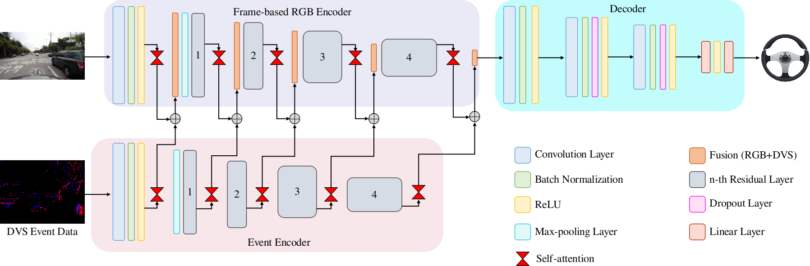

# Self-attention Multi-Modal Fusion Network for Learning End-to-End Control Policies
## [Paper]() 


This repository contains the code for **Self-attention Multi-Modal Fusion Network for Learning End-to-End Control Policies**. 


## **Contents**
1. [Demo Videos](#demo-videos)
2. [Setup](#setup)
3. [Dataset](#dataset)
4. [Dataset Generation](#dataset-generation)
5. [Training](#training)
6. [Evaluation](#evaluation)


## **Demo Videos**
[[DRFuser Data Demo]](https://photos.app.goo.gl/tPomcSXxqgr4fWwT8)[[DDD Demo]](https://photos.app.goo.gl/1qXs5jcDzAZKehZT8) [[Carla EventScape Data Demo]](https://photos.app.goo.gl/CskC8qJbxZhk843U7)


## **Setup**
Install anaconda
```Shell
wget https://repo.anaconda.com/miniconda/Miniconda3-py38_4.10.3-Linux-x86_64.sh
bash Miniconda3-py38_4.10.3-Linux-x86_64.sh
source ~/.bashrc
```

Clone the repo and build the environment
```Shell
git clone https://github.com/azamshoaib/DRFuser.git
cd DRFuser
conda create -n drfuser python=3.8
conda activate drfuser
pip install torch==1.8.0+cu111 torchvision==0.9.0+cu111 torchaudio==0.8.0 -f https://download.pytorch.org/whl/torch_stable.html
pip install -r requirements.txt
```
## **Dataset**
A. **DRFuser Dataset** \
Our collected dataset include event, frame-based RGB and vehicle control data can be requested at https://forms.gle/dTHTfigxx2nNNtuQ6.

B. **Davis Driving Dataset (DDD)** \
The Davis Driving dataset can be downloaded from https://sites.google.com/view/davis-driving-dataset-2020/home

C. **Carla Eventscape Dataset**

The Carla Eventscape dataset can be downloaded at http://rpg.ifi.uzh.ch/RAMNet.html

## **Dataset Generation**
1. DRFuser Dataset \
The raw dataset can be requested at \
i) **Pre-processing of data** \
**Note: We recommend to deactivate the conda environment and install the following dependencies on the system.** \
    - Install ROS and its dependencies from http://wiki.ros.org/Installation/Ubuntu . In our experimentation we have used ROS **melodic**. Please check your Ubuntu and install the respective ROS version.
    - Create the workspace
    ```Shell
    $ mkdir -p ~/workspace/src
    $ git clone https://github.com/uzh-rpg/rpg_dvs_ros.git
    $ cp msgs ~/workspace/src/
    $ cd ~/workspace/
    $ rosdep install --from-paths src --ignore-src -r -y
    $ catkin_make
    $ source devel/setup.bash
    ```
    - Install the ```bagpy```
    ```
    pip install bagpy
    ```
    - Run the following script for the data synchronizing
    ```
    python data_synchronize.py
    ```
    - After the running the ```data_synchronize.py```, two folders with aps_data and dvs_data will be created. The complete synchronize data in csv format will also be created in the same rosbag folder.
    - The following illustrates the folder structure after running the script
    ```
    /path/to/rosbag_file
        ├── /aps_data
        ├── /aps_data_day2-2-gist.csv
        ├── /can_info.csv
        ├── /can_out_sync.csv
        ├── /complete_data.csv
        ├── /dvs_data
        ├── /dvs_data_day2-2-gist.csv
        ├── /dvs_out_sync.csv
    ```

## **Training**

For training the network using DRFuser dataset, run the following script
```
python train.py
```
The ```train.py``` provide a explanation about the different arguments used in the script.

## **Evaluation**

Testing a network is done by using two scripts. First, the ```test.py``` script is used to save the predictions from the network. As a second step, the ```visualize.py``` script is used to visualize the results on the dataset.

**Note:** The scripts for training and evaluation are same for the DDD and Carla Eventscape datasets. The required arguments in the ```train.py``` must be changed before using the aforementioned datasets.


